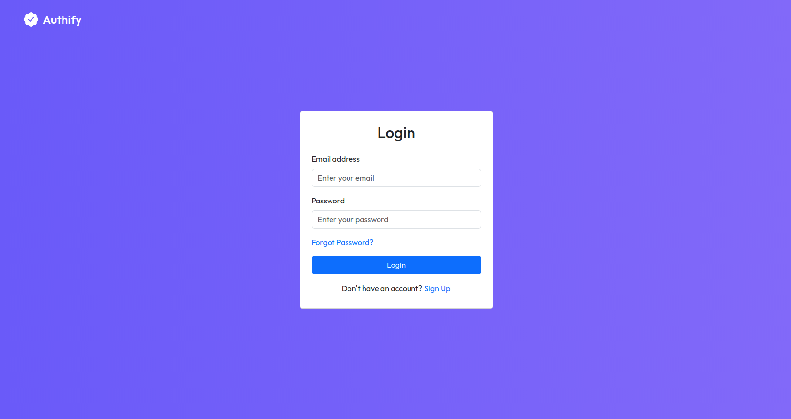
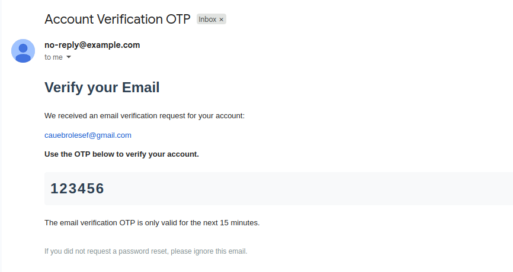

# Authify 🔐✨

<div style="display:flex; gap:10px; width:100%;">
  
  
</div>

<br>

A modern **full-stack authentication and user management platform** with secure login, email verification, password reset via OTP, and JWT-based session handling.

Built with **Spring Boot**, **Spring Security**, **JWT**, **MySQL**, and **React (Vite)**, following clean architecture and real-world authentication best practices.

This project was designed for learning, production-like implementation, and as a reusable authentication foundation for scalable web applications.

## 📌 Table of Contents

- [Authify 🔐✨](#authify-)
    - [📌 Table of Contents](#-table-of-contents)
    - [🌐 Overview](#-overview)
    - [⚙️ Features](#️-features)
    - [🔐 Authentication \& Security](#-authentication--security)
        - [JWT Authentication](#jwt-authentication)
        - [Email Verification](#email-verification)
        - [Password Reset (OTP)](#password-reset-otp)
    - [💻 Technologies Used](#-technologies-used)
        - [Backend](#backend)
        - [Frontend](#frontend)
    - [🗝️ Key Takeaways](#️-key-takeaways)
    - [🚀 How to Run the Project](#-how-to-run-the-project)
        - [Backend (Spring Boot)](#backend-spring-boot)
            - [1️⃣ Configure environment variables](#1️⃣-configure-environment-variables)
            - [2️⃣ Run the backend](#2️⃣-run-the-backend)
        - [Frontend (React + Vite)](#frontend-react--vite)
            - [1️⃣ Install dependencies](#1️⃣-install-dependencies)
            - [2️⃣ Run development server](#2️⃣-run-development-server)
    - [📄 API Endpoints](#-api-endpoints)
        - [🔑 Authentication](#-authentication)
        - [👤 Profile](#-profile)
    - [🤝 Contributing](#-contributing)
    - [💬 Contact](#-contact)

## 🌐 Overview

**Authify** is a complete authentication system designed for modern web applications.

It provides:

- Secure login with JWT stored in HTTP-only cookies
- Email verification using OTP
- Password reset via OTP email
- User registration with welcome email
- Stateless authentication with Spring Security
- React frontend with protected routes
- Email templates with Thymeleaf
- Secure CORS configuration

The backend follows **stateless security architecture**, and the frontend communicates through authenticated API requests.

## ⚙️ Features

- 🔐 **JWT-based authentication**
- 🍪 **HTTP-only cookie session storage**
- 👤 **User registration**
- 📧 **Welcome email on signup**
- ✉️ **Email verification via OTP**
- 🔑 **Password reset with OTP**
- 🧠 **Secure Spring Security configuration**
- 🛡️ **Custom authentication entry point**
- 🌐 **CORS configured for frontend integration**
- 🧾 **Thymeleaf HTML email templates**
- ⚡ **React frontend with routing**
- 🧪 **Clean layered backend architecture**

## 🔐 Authentication & Security

Authify uses **Spring Security + JWT + HTTP-only cookies**.

### JWT Authentication

- Users authenticate via `/login`
- JWT is generated after successful authentication
- Token is stored in:
    - HTTP-only cookie (primary session mechanism)
    - Response body (optional usage)

This prevents JavaScript access and improves security against XSS.

### Email Verification

- Authenticated users request a verification OTP
- OTP is sent via email
- User submits OTP to verify account

Verification emails are sent using **HTML templates** rendered with Thymeleaf.

### Password Reset (OTP)

- User requests reset OTP via email
- OTP expires after a limited time
- User submits OTP + new password
- Password is securely updated

## 💻 Technologies Used

### Backend

- **Java 21**
- **Spring Boot 4**
- **Spring Security**
- **JWT (jjwt)**
- **Spring Data JPA / Hibernate**
- **MySQL**
- **Spring Mail**
- **Thymeleaf (email templates)**
- **Jakarta Validation**
- **Lombok**
- **Maven**

### Frontend

- **React 19**
- **Vite**
- **React Router**
- **Axios**
- **React Toastify**
- **Bootstrap**

## 🗝️ Key Takeaways

1. Secure authentication with JWT and cookies
2. Stateless backend architecture
3. Email-based verification and password recovery
4. Full-stack integration (Spring Boot + React)
5. Production-style authentication flows
6. Clean security configuration with custom filters

## 🚀 How to Run the Project

### Backend (Spring Boot)

#### 1️⃣ Configure environment variables

Example `.env`:

```properties
# database
DB_URL=jdbc:mysql://localhost:3306/authify_app
DB_USER=root
DB_PASSWORD=root

# jwt
JWT_SECRET_KEY=your_super_secret_jwt_key_here_change_this

# frontend
FRONTEND_URL=http://localhost:5173

# mail (smtp)
MAIL_HOST=smtp.gmail.com
MAIL_PORT=587
MAIL_USER=your_email@gmail.com
MAIL_PASSWORD=your_email_app_password
MAIL_FROM=your_email@gmail.com
```

#### 2️⃣ Run the backend

```bash
mvn spring-boot:run
```

Backend runs at:

```
http://localhost:8080
```

### Frontend (React + Vite)

#### 1️⃣ Install dependencies

```bash
npm install
```

#### 2️⃣ Run development server

```bash
npm run dev
```

Frontend runs at:

```
http://localhost:5173
```

## 📄 API Endpoints

### 🔑 Authentication

| Method | Endpoint            | Description                         |
| ------ | ------------------- | ----------------------------------- |
| POST   | `/login`            | Authenticate and receive JWT cookie |
| GET    | `/is-authenticated` | Check authentication status         |
| POST   | `/logout`           | Clear JWT cookie                    |
| POST   | `/send-reset-otp`   | Send password reset OTP             |
| POST   | `/reset-password`   | Reset password using OTP            |
| POST   | `/send-verify-otp`  | Send email verification OTP         |
| POST   | `/verify-otp`       | Verify email with OTP               |

### 👤 Profile

| Method | Endpoint    | Description                    |
| ------ | ----------- | ------------------------------ |
| POST   | `/register` | Register new user              |
| GET    | `/profile`  | Get authenticated user profile |

## 🤝 Contributing

Contributions are welcome!

Feel free to open issues or submit pull requests to improve the project.

## 💬 Contact

For any inquiries or collaboration opportunities, feel free to reach out via:

[](mailto:cauebrolesef@gmail.com)
[](https://www.linkedin.com/in/cauebrolesef/)
[](https://www.instagram.com/cauebf_/)
[](https://github.com/Cauebf)

<p align="right">(<a href="#authify-">back to top</a>)</p>
